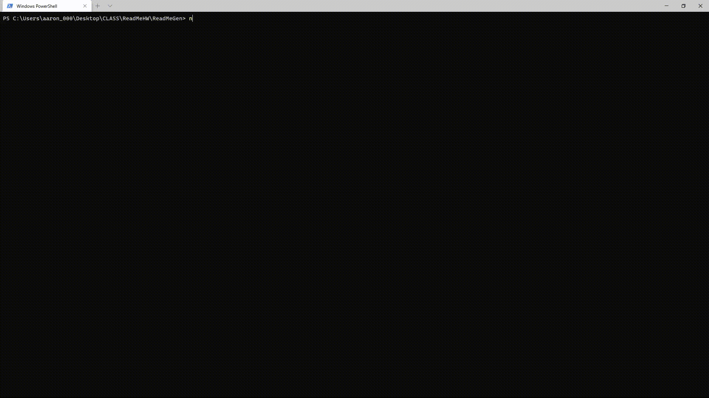

	To use this ReadMeGen you must open a command line/terminal.

	Once you have a terminal open, you must go to the folder location in the terminal. If the folder is on your Desktop, type this command in your terminal: "cd desktop/ReadMeGen". 
		If it is not on your Desktop, type this command: "cd ReadMeGen"

	Once you get in the folder location, type this command to run the app: "node index.js". If you do not have node.js, this program will not work. Go here to install node.js 'https://nodejs.org/en/'
	
	This video will show you how to use the program:
		
